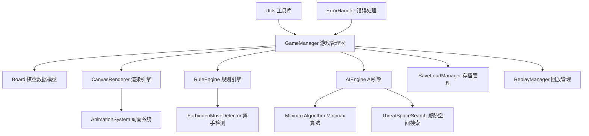
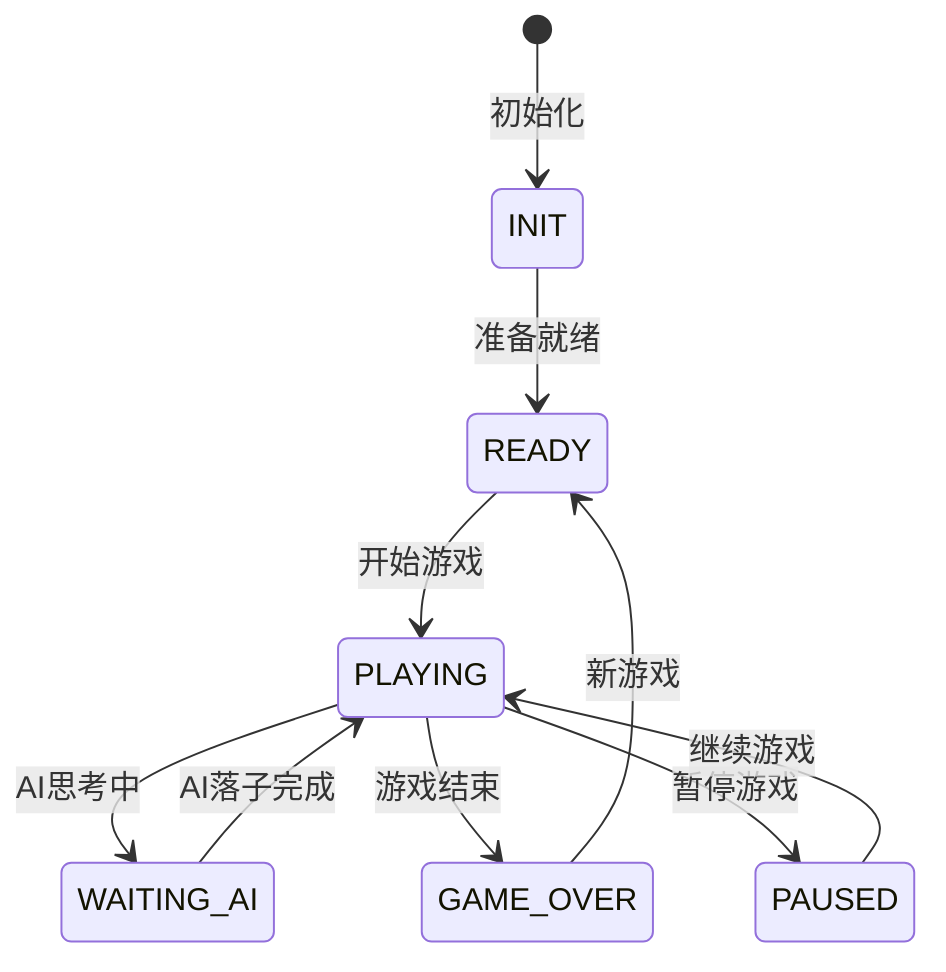
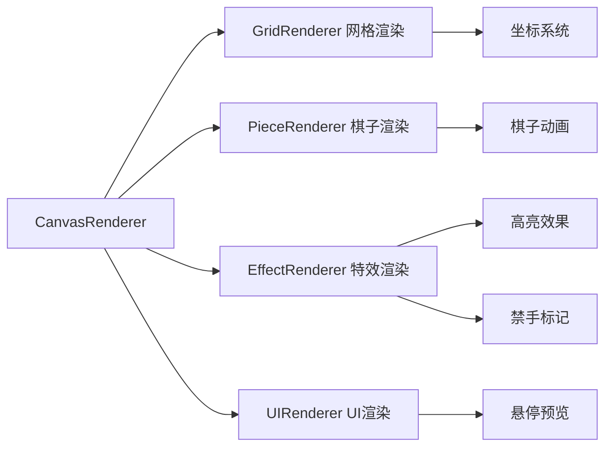
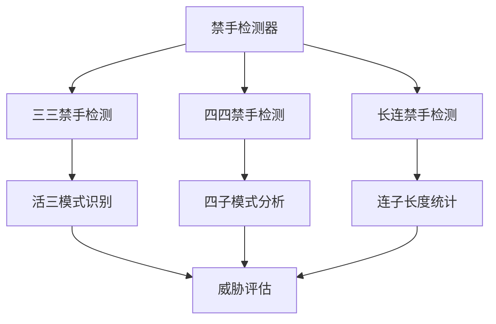
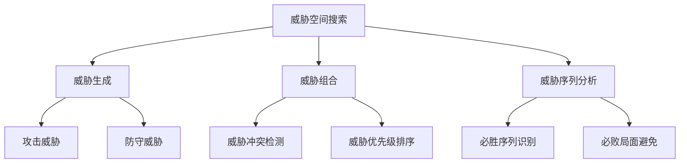
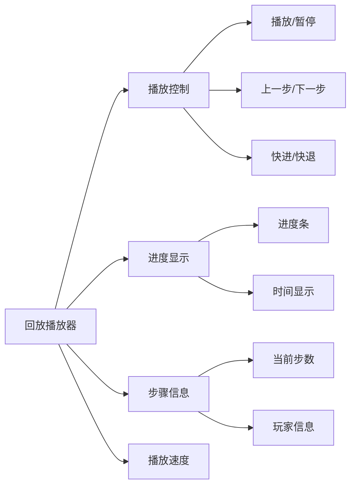

# WebGoFive-H5-Qoder 功能实装设计文档

## 概述

基于已完成的界面设计，本文档详细规划WebGoFive-H5-Qoder五子棋游戏的核心功能实装方案。项目采用纯JavaScript(ES6+)开发，基于HTML5 Canvas 2D API渲染，采用模块化架构设计。

## 技术栈与架构

### 核心技术
- **前端技术**: HTML5 Canvas, JavaScript(ES6+), CSS3
- **开发模式**: 纯原生JavaScript，无第三方框架依赖
- **架构模式**: 模块化架构 + 观察者模式 + 策略模式

### 模块架构设计



## 核心功能模块设计

### 1. 游戏管理器 (GameManager)

#### 1.1 模块职责
- 游戏状态管理和流程控制
- 模块间通信协调
- 用户输入事件处理
- 游戏时间和回合管理

#### 1.2 核心接口设计

| 方法名 | 参数 | 返回值 | 描述 |
|--------|------|--------|------|
| initGame() | - | void | 初始化游戏 |
| startNewGame(mode) | GameMode | void | 开始新游戏 |
| placePiece(x, y) | number, number | boolean | 落子操作 |
| undoMove() | - | boolean | 悔棋操作 |
| switchMode() | - | void | 切换游戏模式 |
| saveGame() | - | string | 保存游戏 |
| loadGame(data) | string | boolean | 加载游戏 |

#### 1.3 状态管理



### 2. 棋盘数据模型 (Board)

#### 2.1 数据结构设计
```javascript
class Board {
    constructor() {
        this.grid = Array(15).fill().map(() => Array(15).fill(0)); // 0:空位, 1:黑棋, 2:白棋
        this.moveHistory = []; // 移动历史
        this.currentPlayer = 1; // 当前玩家
        this.gameStatus = 'PLAYING'; // 游戏状态
    }
}
```

#### 2.2 核心方法

| 方法名 | 功能描述 | 复杂度 |
|--------|----------|--------|
| placePiece(x, y, player) | 落子操作 | O(1) |
| isPosValid(x, y) | 验证位置有效性 | O(1) |
| getValidMoves() | 获取所有有效位置 | O(n²) |
| undoLastMove() | 撤销最后一步 | O(1) |
| clone() | 深拷贝棋盘状态 | O(n²) |

### 3. 渲染引擎 (CanvasRenderer)

#### 3.1 渲染系统架构



#### 3.2 渲染性能优化

| 优化策略 | 实现方案 | 性能提升 |
|----------|----------|----------|
| 局部刷新 | 仅重绘变化区域 | 60% |
| 双缓冲 | 离屏Canvas预渲染 | 40% |
| 事件节流 | 限制mousemove频率 | 30% |
| 图层分离 | 静态背景与动态元素分层 | 50% |

#### 3.3 动画系统设计

```javascript
class AnimationSystem {
    constructor() {
        this.animations = new Map();
        this.isAnimating = false;
    }
    
    // 落子动画
    createDropAnimation(x, y, piece) {
        return {
            type: 'DROP',
            startTime: Date.now(),
            duration: 300,
            easing: 'easeOutBounce',
            keyframes: [
                { offset: 0, scale: 0, opacity: 0.8 },
                { offset: 0.7, scale: 1.2, opacity: 0.9 },
                { offset: 1, scale: 1, opacity: 1 }
            ]
        };
    }
}
```

### 4. 规则引擎 (RuleEngine)

#### 4.1 胜负判定算法

```javascript
class WinChecker {
    checkWin(board, lastMove) {
        const directions = [
            [1, 0],   // 水平
            [0, 1],   // 垂直
            [1, 1],   // 对角线1
            [1, -1]   // 对角线2
        ];
        
        for (let dir of directions) {
            if (this.checkDirection(board, lastMove, dir)) {
                return true;
            }
        }
        return false;
    }
}
```

#### 4.2 禁手检测系统



#### 4.3 禁手规则实现

| 禁手类型 | 检测算法 | 时间复杂度 |
|----------|----------|------------|
| 三三禁手 | 双向扫描 + 模式匹配 | O(8) |
| 四四禁手 | 四方向威胁分析 | O(8) |
| 长连禁手 | 连续性检测 | O(4) |

### 5. AI引擎 (AIEngine)

#### 5.1 AI难度等级设计

| 难度等级 | 搜索深度 | 算法策略 | 响应时间 |
|----------|----------|----------|----------|
| 新手级别 | 2层 | 简单Minimax | <0.5s |
| 正常级别 | 4层 | Minimax + Alpha-Beta | <1.5s |
| 困难级别 | 8层 | 威胁序列分析 | <2.5s |
| 地狱级别 | 12层 | 威胁空间搜索 | <3s |

#### 5.2 评估函数设计

```javascript
class PositionEvaluator {
    evaluate(board, player) {
        return (
            this.evaluateLines(board, player) * 0.4 +
            this.evaluateCenter(board, player) * 0.2 +
            this.evaluateThreats(board, player) * 0.3 +
            this.evaluateDefense(board, player) * 0.1
        );
    }
}
```

#### 5.3 威胁空间搜索算法



### 6. 存档管理系统 (SaveLoadManager)

#### 6.1 数据格式设计

```javascript
const gameDataFormat = {
    version: "1.0",
    timestamp: "2024-01-01T00:00:00Z",
    gameMode: "PvE",
    difficulty: "NORMAL",
    currentPlayer: 1,
    moveCount: 25,
    gameTime: 300,
    board: [[0,0,1,2,...], ...],
    moveHistory: [
        { x: 7, y: 7, player: 1, timestamp: 1000 },
        { x: 8, y: 8, player: 2, timestamp: 2000 }
    ],
    gameStatus: "PLAYING"
};
```

#### 6.2 存档功能实现

| 功能 | 实现方案 | 存储方式 |
|------|----------|----------|
| 手动保存 | JSON序列化 | 本地文件下载 |
| 自动保存 | LocalStorage | 浏览器本地存储 |
| 快照保存 | 关键节点记录 | 内存缓存 |
| 云端同步 | RESTful API | 服务器存储(未来) |

### 7. 回放管理系统 (ReplayManager)

#### 7.1 回放控制器设计

```javascript
class ReplayController {
    constructor(gameData) {
        this.moves = gameData.moveHistory;
        this.currentStep = 0;
        this.isPlaying = false;
        this.playbackSpeed = 1.0;
    }
    
    // 回放控制方法
    play() { /* 开始播放 */ }
    pause() { /* 暂停播放 */ }
    stop() { /* 停止播放 */ }
    stepForward() { /* 前进一步 */ }
    stepBackward() { /* 后退一步 */ }
    seekTo(step) { /* 跳转到指定步骤 */ }
}
```

#### 7.2 播放器UI组件



## 用户交互功能设计

### 1. 输入处理系统

#### 1.1 鼠标交互
- **点击落子**: 坐标转换 + 有效性验证
- **悬停预览**: 实时渲染半透明棋子
- **右键菜单**: 自定义上下文菜单(可选)

#### 1.2 键盘快捷键

| 快捷键 | 功能 | 实现优先级 |
|--------|------|------------|
| Ctrl+N | 新游戏 | P0 |
| Ctrl+Z | 悔棋 | P0 |
| Space | 暂停/继续 | P1 |
| H | 获取提示 | P1 |
| M | 切换模式 | P2 |
| S | 保存游戏 | P2 |
| L | 加载游戏 | P2 |

#### 1.3 触摸支持
- **单点触控**: 落子操作
- **长按**: 显示坐标信息
- **双击**: 快速重新开始

### 2. 用户提示系统

#### 2.1 提示信息分类

| 提示类型 | 显示方式 | 持续时间 |
|----------|----------|----------|
| 操作提示 | 状态栏文字 | 实时更新 |
| 错误提示 | 红色通知框 | 3秒 |
| 成功提示 | 绿色通知框 | 2秒 |
| 禁手警告 | 橙色高亮 | 持续显示 |
| 胜利庆祝 | 模态弹窗 + 动画 | 用户关闭 |

#### 2.2 智能提示功能
```javascript
class HintSystem {
    generateHint(board, player, difficulty) {
        const threats = this.findThreats(board, player);
        const opportunities = this.findOpportunities(board, player);
        
        return {
            type: this.determineHintType(threats, opportunities),
            position: this.selectBestMove(threats, opportunities),
            explanation: this.generateExplanation(),
            confidence: this.calculateConfidence()
        };
    }
}
```

## 性能优化设计

### 1. 渲染优化策略

#### 1.1 帧率优化
- **目标帧率**: 60 FPS
- **渲染节流**: requestAnimationFrame
- **局部更新**: 脏矩形技术
- **图层分离**: 静态背景与动态前景

#### 1.2 内存管理
```javascript
class MemoryManager {
    constructor() {
        this.objectPool = new Map(); // 对象池
        this.cachedImages = new Map(); // 图片缓存
    }
    
    // 对象池管理
    borrowPiece() { /* 从池中获取棋子对象 */ }
    returnPiece(piece) { /* 归还棋子对象到池中 */ }
    
    // 内存清理
    cleanup() { /* 清理未使用的资源 */ }
}
```

### 2. 算法优化策略

#### 2.1 AI计算优化
- **Alpha-Beta剪枝**: 减少搜索树节点
- **置换表**: 缓存已计算的位置评估
- **迭代加深**: 渐进式搜索深度
- **移动排序**: 优先搜索有希望的移动

#### 2.2 缓存策略

| 缓存类型 | 缓存内容 | 失效策略 |
|----------|----------|----------|
| 位置评估缓存 | 棋盘状态->评估值 | LRU算法 |
| 禁手检测缓存 | 位置->禁手类型 | 棋盘变化时清空 |
| 渲染缓存 | 静态图像资源 | 手动管理 |
| 计算结果缓存 | AI搜索结果 | 时间过期 |

## 错误处理与调试

### 1. 错误处理系统

#### 1.1 错误分类与处理

```javascript
class ErrorHandler {
    static handleError(error, context) {
        switch (error.type) {
            case 'RENDER_ERROR':
                return this.handleRenderError(error, context);
            case 'AI_ERROR':
                return this.handleAIError(error, context);
            case 'SAVE_ERROR':
                return this.handleSaveError(error, context);
            default:
                return this.handleGenericError(error, context);
        }
    }
}
```

#### 1.2 用户友好的错误提示

| 错误类型 | 技术错误信息 | 用户提示信息 |
|----------|--------------|--------------|
| 网络错误 | NetworkError: Failed to fetch | 网络连接异常，请检查网络后重试 |
| 存档错误 | JSON.parse failed | 存档文件格式错误，无法加载 |
| 渲染错误 | Canvas context is null | 浏览器不支持，请升级浏览器 |
| AI错误 | AI calculation timeout | AI思考超时，已为您随机选择 |

### 2. 调试与监控

#### 2.1 开发调试工具
```javascript
class DebugConsole {
    constructor() {
        this.isEnabled = process.env.NODE_ENV === 'development';
        this.logs = [];
    }
    
    logMove(x, y, player) { /* 记录移动 */ }
    logAIDecision(decision) { /* 记录AI决策 */ }
    logPerformance(action, time) { /* 记录性能数据 */ }
    exportLogs() { /* 导出调试日志 */ }
}
```

#### 2.2 性能监控指标

| 指标名称 | 监控方法 | 告警阈值 |
|----------|----------|----------|
| 渲染帧率 | Performance API | <50 FPS |
| AI响应时间 | Date.now()差值 | >3秒 |
| 内存使用量 | performance.memory | >50MB |
| 错误发生率 | 错误计数/总操作 | >1% |

## 测试策略

### 1. 单元测试

#### 1.1 核心模块测试覆盖

| 模块 | 测试用例数 | 覆盖率目标 |
|------|-----------|------------|
| Board | 25 | 95% |
| RuleEngine | 30 | 98% |
| AIEngine | 20 | 85% |
| SaveLoadManager | 15 | 90% |
| CanvasRenderer | 10 | 70% |

#### 1.2 测试用例示例
```javascript
describe('RuleEngine', () => {
    test('should detect horizontal win', () => {
        const board = createTestBoard();
        board.placePieces([[7,7,1], [7,8,1], [7,9,1], [7,10,1], [7,11,1]]);
        expect(ruleEngine.checkWin(board, {x:7, y:11})).toBe(true);
    });
    
    test('should detect three-three forbidden move', () => {
        const board = createForbiddenTestBoard();
        expect(ruleEngine.isForbiddenMove(board, 7, 7, 1)).toBe(true);
    });
});
```

### 2. 集成测试

#### 2.1 用户场景测试
- **完整对局流程**: 开始->落子->胜负判定->结束
- **模式切换**: PvP ↔ PvE模式转换
- **存档功能**: 保存->退出->加载->继续
- **回放功能**: 完整对局->生成回放->播放控制

#### 2.2 性能测试
- **压力测试**: 连续1000次AI计算
- **内存泄漏测试**: 长时间运行监控
- **兼容性测试**: 多浏览器环境验证

## 安全与数据保护

### 1. 客户端安全

#### 1.1 输入验证
```javascript
class InputValidator {
    static validateMove(x, y) {
        return Number.isInteger(x) && 
               Number.isInteger(y) && 
               x >= 0 && x < 15 && 
               y >= 0 && y < 15;
    }
    
    static sanitizeInput(input) {
        return input.toString().replace(/[<>'"&]/g, '');
    }
}
```

#### 1.2 数据完整性
- **存档验证**: 校验和检查
- **历史验证**: 移动序列合法性检查
- **状态一致性**: 棋盘状态与历史一致性验证

### 2. 隐私保护

#### 2.1 数据存储原则
- **最小化原则**: 仅存储必要的游戏数据
- **本地优先**: 优先使用本地存储
- **用户控制**: 用户可随时清除数据
- **透明度**: 明确告知数据用途

## 核心模块代码实现

### 1. 基础工具模块 (Utils.js)

```javascript
/**
 * 基础工具模块 - 提供通用的工具函数和常量定义
 * @module Utils
 * @version 1.0.0
 */
class Utils {
    // 游戏常量定义
    static CONSTANTS = {
        BOARD_SIZE: 15,
        EMPTY: 0,
        BLACK: 1,
        WHITE: 2,
        
        // 游戏状态
        GAME_STATUS: {
            READY: 'READY',
            PLAYING: 'PLAYING',
            PAUSED: 'PAUSED',
            GAME_OVER: 'GAME_OVER',
            WAITING_AI: 'WAITING_AI'
        },
        
        // 游戏模式
        GAME_MODE: {
            PVP: 'PvP',
            PVE: 'PvE'
        },
        
        // AI难度等级
        AI_DIFFICULTY: {
            BEGINNER: 'BEGINNER',
            NORMAL: 'NORMAL',
            HARD: 'HARD',
            HELL: 'HELL'
        },
        
        // 禁手类型
        FORBIDDEN_TYPE: {
            NONE: 'NONE',
            THREE_THREE: 'THREE_THREE',
            FOUR_FOUR: 'FOUR_FOUR',
            OVERLINE: 'OVERLINE'
        },
        
        // 方向向量
        DIRECTIONS: [
            [1, 0],   // 水平
            [0, 1],   // 垂直
            [1, 1],   // 对角线1
            [1, -1]   // 对角线2
        ]
    };
    
    static isValidPosition(x, y) {
        return Number.isInteger(x) && Number.isInteger(y) && 
               x >= 0 && x < this.CONSTANTS.BOARD_SIZE && 
               y >= 0 && y < this.CONSTANTS.BOARD_SIZE;
    }
    
    static deepClone(obj) {
        if (obj === null || typeof obj !== 'object') return obj;
        if (obj instanceof Date) return new Date(obj.getTime());
        if (obj instanceof Array) return obj.map(item => this.deepClone(item));
        
        if (typeof obj === 'object') {
            const cloned = {};
            for (let key in obj) {
                if (obj.hasOwnProperty(key)) {
                    cloned[key] = this.deepClone(obj[key]);
                }
            }
            return cloned;
        }
    }
    
    static formatTime(seconds) {
        const minutes = Math.floor(seconds / 60);
        const remainingSeconds = seconds % 60;
        return `${minutes.toString().padStart(2, '0')}:${remainingSeconds.toString().padStart(2, '0')}`;
    }
    
    static throttle(func, delay) {
        let lastCall = 0;
        return function(...args) {
            const now = Date.now();
            if (now - lastCall >= delay) {
                lastCall = now;
                return func.apply(this, args);
            }
        };
    }
    
    static screenToBoard(screenX, screenY, cellSize, padding) {
        const x = Math.round((screenX - padding) / cellSize);
        const y = Math.round((screenY - padding) / cellSize);
        return { x, y };
    }
    
    static getOpponent(player) {
        return player === this.CONSTANTS.BLACK ? this.CONSTANTS.WHITE : this.CONSTANTS.BLACK;
    }
}
```

### 2. 错误处理模块 (ErrorHandler.js)

```javascript
/**
 * 全局错误处理模块
 * @module ErrorHandler
 */
class ErrorHandler {
    constructor() {
        this.errorLog = [];
        this.maxLogSize = 100;
        this.setupGlobalErrorHandling();
    }
    
    setupGlobalErrorHandling() {
        // 捕获未处理的错误
        window.addEventListener('error', (event) => {
            this.handleError({
                type: 'RUNTIME_ERROR',
                message: event.message,
                filename: event.filename,
                lineno: event.lineno,
                colno: event.colno,
                error: event.error
            });
        });
        
        // 捕获Promise rejection
        window.addEventListener('unhandledrejection', (event) => {
            this.handleError({
                type: 'PROMISE_REJECTION',
                message: event.reason?.message || 'Unhandled Promise Rejection',
                reason: event.reason
            });
        });
    }
    
    handleError(error, context = {}) {
        const errorInfo = {
            id: Utils.generateId(),
            timestamp: new Date().toISOString(),
            type: error.type || 'UNKNOWN_ERROR',
            message: error.message || 'Unknown error occurred',
            context,
            stack: error.stack,
            userAgent: navigator.userAgent
        };
        
        // 记录错误
        this.logError(errorInfo);
        
        // 根据错误类型处理
        switch (error.type) {
            case 'RENDER_ERROR':
                return this.handleRenderError(errorInfo);
            case 'AI_ERROR':
                return this.handleAIError(errorInfo);
            case 'SAVE_ERROR':
                return this.handleSaveError(errorInfo);
            case 'NETWORK_ERROR':
                return this.handleNetworkError(errorInfo);
            default:
                return this.handleGenericError(errorInfo);
        }
    }
    
    handleRenderError(errorInfo) {
        console.error('渲染错误:', errorInfo);
        this.showUserMessage('渲染出现问题，正在尝试恢复...', 'warning');
        
        // 尝试重新初始化渲染器
        try {
            if (window.canvasRenderer) {
                window.canvasRenderer.reinitialize();
            }
            return true;
        } catch (e) {
            this.showUserMessage('渲染器无法恢复，请刷新页面', 'error');
            return false;
        }
    }
    
    handleAIError(errorInfo) {
        console.error('AI计算错误:', errorInfo);
        this.showUserMessage('AI思考出现问题，将随机选择一步', 'warning');
        
        // 触发随机落子作为fallback
        if (window.gameManager) {
            window.gameManager.makeRandomMove();
        }
        return true;
    }
    
    handleSaveError(errorInfo) {
        console.error('保存错误:', errorInfo);
        this.showUserMessage('保存失败，请检查浏览器存储权限', 'error');
        return false;
    }
    
    logError(errorInfo) {
        this.errorLog.push(errorInfo);
        
        // 限制日志大小
        if (this.errorLog.length > this.maxLogSize) {
            this.errorLog.shift();
        }
        
        // 开发环境下输出详细错误
        if (this.isDevelopment()) {
            console.error('错误详情:', errorInfo);
        }
    }
    
    showUserMessage(message, type = 'info', duration = 3000) {
        // 创建用户友好的错误提示
        const notification = document.createElement('div');
        notification.className = `notification notification--${type}`;
        notification.textContent = message;
        
        document.body.appendChild(notification);
        
        // 自动移除通知
        setTimeout(() => {
            if (notification.parentNode) {
                notification.parentNode.removeChild(notification);
            }
        }, duration);
    }
    
    isDevelopment() {
        return window.location.hostname === 'localhost' || 
               window.location.hostname === '127.0.0.1';
    }
    
    getErrorReport() {
        return {
            errors: this.errorLog,
            browserInfo: Utils.getBrowserInfo(),
            timestamp: new Date().toISOString()
        };
    }
}
```

### 3. 棋盘数据模型 (Board.js)

```javascript
/**
 * 棋盘数据模型
 * @module Board
 */
class Board {
    constructor() {
        this.grid = Array(Utils.CONSTANTS.BOARD_SIZE).fill()
            .map(() => Array(Utils.CONSTANTS.BOARD_SIZE).fill(Utils.CONSTANTS.EMPTY));
        this.moveHistory = [];
        this.currentPlayer = Utils.CONSTANTS.BLACK;
        this.gameStatus = Utils.CONSTANTS.GAME_STATUS.READY;
        this.lastMove = null;
    }
    
    /**
     * 在指定位置落子
     * @param {number} x - X坐标
     * @param {number} y - Y坐标
     * @param {number} player - 玩家编号
     * @returns {boolean} 是否成功落子
     */
    placePiece(x, y, player) {
        if (!this.isValidMove(x, y)) {
            return false;
        }
        
        this.grid[y][x] = player;
        const move = {
            x, y, player,
            timestamp: Date.now(),
            moveNumber: this.moveHistory.length + 1
        };
        
        this.moveHistory.push(move);
        this.lastMove = move;
        this.currentPlayer = Utils.getOpponent(player);
        
        return true;
    }
    
    /**
     * 检查指定位置是否可以落子
     * @param {number} x - X坐标
     * @param {number} y - Y坐标
     * @returns {boolean} 是否可以落子
     */
    isValidMove(x, y) {
        return Utils.isValidPosition(x, y) && this.grid[y][x] === Utils.CONSTANTS.EMPTY;
    }
    
    /**
     * 撤销最后一步棋
     * @returns {boolean} 是否成功撤销
     */
    undoLastMove() {
        if (this.moveHistory.length === 0) {
            return false;
        }
        
        const lastMove = this.moveHistory.pop();
        this.grid[lastMove.y][lastMove.x] = Utils.CONSTANTS.EMPTY;
        this.currentPlayer = lastMove.player;
        
        // 更新lastMove
        this.lastMove = this.moveHistory.length > 0 ? 
            this.moveHistory[this.moveHistory.length - 1] : null;
        
        return true;
    }
    
    /**
     * 获取所有有效的落子位置
     * @returns {Array} 有效位置数组
     */
    getValidMoves() {
        const moves = [];
        for (let x = 0; x < Utils.CONSTANTS.BOARD_SIZE; x++) {
            for (let y = 0; y < Utils.CONSTANTS.BOARD_SIZE; y++) {
                if (this.isValidMove(x, y)) {
                    moves.push({ x, y });
                }
            }
        }
        return moves;
    }
    
    /**
     * 深拷贝棋盘状态
     * @returns {Board} 新的棋盘实例
     */
    clone() {
        const newBoard = new Board();
        newBoard.grid = this.grid.map(row => [...row]);
        newBoard.moveHistory = Utils.deepClone(this.moveHistory);
        newBoard.currentPlayer = this.currentPlayer;
        newBoard.gameStatus = this.gameStatus;
        newBoard.lastMove = Utils.deepClone(this.lastMove);
        return newBoard;
    }
    
    /**
     * 重置棋盘
     */
    reset() {
        this.grid = Array(Utils.CONSTANTS.BOARD_SIZE).fill()
            .map(() => Array(Utils.CONSTANTS.BOARD_SIZE).fill(Utils.CONSTANTS.EMPTY));
        this.moveHistory = [];
        this.currentPlayer = Utils.CONSTANTS.BLACK;
        this.gameStatus = Utils.CONSTANTS.GAME_STATUS.READY;
        this.lastMove = null;
    }
    
    /**
     * 获取指定位置的棋子
     * @param {number} x - X坐标
     * @param {number} y - Y坐标
     * @returns {number} 棋子类型
     */
    getPiece(x, y) {
        if (!Utils.isValidPosition(x, y)) {
            return Utils.CONSTANTS.EMPTY;
        }
        return this.grid[y][x];
    }
    
    /**
     * 检查棋盘是否已满
     * @returns {boolean} 是否已满
     */
    isFull() {
        return this.getValidMoves().length === 0;
    }
    
    /**
     * 获取棋盘状态的哈希值
     * @returns {string} 哈希值
     */
    getHash() {
        return this.grid.map(row => row.join('')).join('|');
    }
    
    /**
     * 从JSON数据恢复棋盘状态
     * @param {Object} data - 棋盘数据
     */
    fromJSON(data) {
        this.grid = data.grid || this.grid;
        this.moveHistory = data.moveHistory || [];
        this.currentPlayer = data.currentPlayer || Utils.CONSTANTS.BLACK;
        this.gameStatus = data.gameStatus || Utils.CONSTANTS.GAME_STATUS.READY;
        this.lastMove = data.lastMove || null;
    }
    
    /**
     * 将棋盘状态转换为JSON
     * @returns {Object} JSON数据
     */
    toJSON() {
        return {
            grid: this.grid,
            moveHistory: this.moveHistory,
            currentPlayer: this.currentPlayer,
            gameStatus: this.gameStatus,
            lastMove: this.lastMove
        };
    }
}
```

### 4. 规则引擎核心实现 (RuleEngine.js)

```javascript
/**
 * 五子棋规则引擎
 * @module RuleEngine
 */
class RuleEngine {
    constructor() {
        this.winChecker = new WinChecker();
        this.forbiddenDetector = new ForbiddenMoveDetector();
    }
    
    /**
     * 检查游戏是否结束
     * @param {Board} board - 棋盘实例
     * @param {Object} lastMove - 最后一步棋
     * @returns {Object} 游戏结果 {isGameOver, winner, reason}
     */
    checkGameEnd(board, lastMove) {
        if (!lastMove) {
            return { isGameOver: false, winner: null, reason: null };
        }
        
        // 检查是否五连
        const winResult = this.winChecker.checkWin(board, lastMove);
        if (winResult.hasWin) {
            return {
                isGameOver: true,
                winner: lastMove.player,
                reason: 'five_in_row',
                winLine: winResult.winLine
            };
        }
        
        // 检查是否和棋（棋盘满）
        if (board.isFull()) {
            return {
                isGameOver: true,
                winner: null,
                reason: 'draw'
            };
        }
        
        return { isGameOver: false, winner: null, reason: null };
    }
    
    /**
     * 检查落子是否有效（包含禁手检查）
     * @param {Board} board - 棋盘实例
     * @param {number} x - X坐标
     * @param {number} y - Y坐标
     * @param {number} player - 玩家编号
     * @returns {Object} 检查结果
     */
    validateMove(board, x, y, player) {
        // 基本有效性检查
        if (!board.isValidMove(x, y)) {
            return {
                isValid: false,
                reason: 'invalid_position',
                message: '该位置无效或已有棋子'
            };
        }
        
        // 禁手检查（仅对黑棋）
        if (player === Utils.CONSTANTS.BLACK) {
            const forbiddenResult = this.forbiddenDetector.checkForbidden(board, x, y, player);
            if (forbiddenResult.isForbidden) {
                return {
                    isValid: false,
                    reason: 'forbidden_move',
                    forbiddenType: forbiddenResult.type,
                    message: this.getForbiddenMessage(forbiddenResult.type)
                };
            }
        }
        
        return { isValid: true, reason: null, message: null };
    }
    
    /**
     * 获取禁手提示信息
     * @param {string} forbiddenType - 禁手类型
     * @returns {string} 提示信息
     */
    getForbiddenMessage(forbiddenType) {
        const messages = {
            [Utils.CONSTANTS.FORBIDDEN_TYPE.THREE_THREE]: '三三禁手：不能同时形成两个活三',
            [Utils.CONSTANTS.FORBIDDEN_TYPE.FOUR_FOUR]: '四四禁手：不能同时形成两个四子',
            [Utils.CONSTANTS.FORBIDDEN_TYPE.OVERLINE]: '长连禁手：不能形成六子或以上连线'
        };
        return messages[forbiddenType] || '禁手落子';
    }
}

/**
 * 胜负判定器
 */
class WinChecker {
    checkWin(board, lastMove) {
        const { x, y, player } = lastMove;
        
        for (let direction of Utils.CONSTANTS.DIRECTIONS) {
            const result = this.checkDirection(board, x, y, player, direction);
            if (result.count >= 5) {
                return {
                    hasWin: true,
                    winLine: result.line,
                    direction: direction
                };
            }
        }
        
        return { hasWin: false, winLine: null, direction: null };
    }
    
    checkDirection(board, x, y, player, direction) {
        const [dx, dy] = direction;
        const line = [{ x, y }];
        let count = 1;
        
        // 正方向搜索
        let currentX = x + dx;
        let currentY = y + dy;
        while (Utils.isValidPosition(currentX, currentY) && 
               board.getPiece(currentX, currentY) === player) {
            line.push({ x: currentX, y: currentY });
            count++;
            currentX += dx;
            currentY += dy;
        }
        
        // 反方向搜索
        currentX = x - dx;
        currentY = y - dy;
        while (Utils.isValidPosition(currentX, currentY) && 
               board.getPiece(currentX, currentY) === player) {
            line.unshift({ x: currentX, y: currentY });
            count++;
            currentX -= dx;
            currentY -= dy;
        }
        
        return { count, line };
    }
}

/**
 * 禁手检测器
 */
class ForbiddenMoveDetector {
    checkForbidden(board, x, y, player) {
        // 创建临时棋盘状态
        const tempBoard = board.clone();
        tempBoard.placePiece(x, y, player);
        
        // 检查各种禁手
        const threeThree = this.checkThreeThree(tempBoard, x, y, player);
        if (threeThree) {
            return { isForbidden: true, type: Utils.CONSTANTS.FORBIDDEN_TYPE.THREE_THREE };
        }
        
        const fourFour = this.checkFourFour(tempBoard, x, y, player);
        if (fourFour) {
            return { isForbidden: true, type: Utils.CONSTANTS.FORBIDDEN_TYPE.FOUR_FOUR };
        }
        
        const overline = this.checkOverline(tempBoard, x, y, player);
        if (overline) {
            return { isForbidden: true, type: Utils.CONSTANTS.FORBIDDEN_TYPE.OVERLINE };
        }
        
        return { isForbidden: false, type: Utils.CONSTANTS.FORBIDDEN_TYPE.NONE };
    }
    
    checkThreeThree(board, x, y, player) {
        let liveThreeCount = 0;
        
        for (let direction of Utils.CONSTANTS.DIRECTIONS) {
            if (this.isLiveThree(board, x, y, player, direction)) {
                liveThreeCount++;
                if (liveThreeCount >= 2) {
                    return true;
                }
            }
        }
        
        return false;
    }
    
    checkFourFour(board, x, y, player) {
        let fourCount = 0;
        
        for (let direction of Utils.CONSTANTS.DIRECTIONS) {
            if (this.isFour(board, x, y, player, direction)) {
                fourCount++;
                if (fourCount >= 2) {
                    return true;
                }
            }
        }
        
        return false;
    }
    
    checkOverline(board, x, y, player) {
        for (let direction of Utils.CONSTANTS.DIRECTIONS) {
            const count = this.countConsecutive(board, x, y, player, direction);
            if (count > 5) {
                return true;
            }
        }
        return false;
    }
    
    isLiveThree(board, x, y, player, direction) {
        const count = this.countConsecutive(board, x, y, player, direction);
        if (count !== 3) return false;
        
        // 检查两端是否都为空位
        const [dx, dy] = direction;
        const endPositions = this.getLineEndPositions(board, x, y, player, direction);
        
        return endPositions.both_empty;
    }
    
    isFour(board, x, y, player, direction) {
        const count = this.countConsecutive(board, x, y, player, direction);
        return count === 4;
    }
    
    countConsecutive(board, x, y, player, direction) {
        const [dx, dy] = direction;
        let count = 1; // 包括当前位置
        
        // 正方向计数
        let currentX = x + dx;
        let currentY = y + dy;
        while (Utils.isValidPosition(currentX, currentY) && 
               board.getPiece(currentX, currentY) === player) {
            count++;
            currentX += dx;
            currentY += dy;
        }
        
        // 反方向计数
        currentX = x - dx;
        currentY = y - dy;
        while (Utils.isValidPosition(currentX, currentY) && 
               board.getPiece(currentX, currentY) === player) {
            count++;
            currentX -= dx;
            currentY -= dy;
        }
        
        return count;
    }
    
    getLineEndPositions(board, x, y, player, direction) {
        const [dx, dy] = direction;
        
        // 找到正方向端点
        let endX1 = x, endY1 = y;
        while (Utils.isValidPosition(endX1 + dx, endY1 + dy) && 
               board.getPiece(endX1 + dx, endY1 + dy) === player) {
            endX1 += dx;
            endY1 += dy;
        }
        
        // 找到反方向端点
        let endX2 = x, endY2 = y;
        while (Utils.isValidPosition(endX2 - dx, endY2 - dy) && 
               board.getPiece(endX2 - dx, endY2 - dy) === player) {
            endX2 -= dx;
            endY2 -= dy;
        }
        
        // 检查端点外一位是否为空
        const pos1Empty = Utils.isValidPosition(endX1 + dx, endY1 + dy) && 
                         board.getPiece(endX1 + dx, endY1 + dy) === Utils.CONSTANTS.EMPTY;
        const pos2Empty = Utils.isValidPosition(endX2 - dx, endY2 - dy) && 
                         board.getPiece(endX2 - dx, endY2 - dy) === Utils.CONSTANTS.EMPTY;
        
        return {
            end1: { x: endX1, y: endY1 },
            end2: { x: endX2, y: endY2 },
            pos1_empty: pos1Empty,
            pos2_empty: pos2Empty,
            both_empty: pos1Empty && pos2Empty
        };
    }
}
```

### 6. 渲染引擎 (CanvasRenderer.js)

```javascript
/**
 * Canvas渲染引擎
 */
class CanvasRenderer {
    constructor(canvasId, board) {
        this.canvas = document.getElementById(canvasId);
        this.ctx = this.canvas.getContext('2d');
        this.board = board;
        
        this.cellSize = 36;
        this.padding = 30;
        this.boardWidth = (Utils.CONSTANTS.BOARD_SIZE - 1) * this.cellSize;
        this.boardHeight = (Utils.CONSTANTS.BOARD_SIZE - 1) * this.cellSize;
        
        this.canvas.width = this.boardWidth + this.padding * 2;
        this.canvas.height = this.boardHeight + this.padding * 2;
        
        this.hoverPosition = null;
        this.winLine = null;
        this.hintPosition = null;
        this.animationSystem = new AnimationSystem(this);
    }
    
    render() {
        this.ctx.clearRect(0, 0, this.canvas.width, this.canvas.height);
        
        this.drawBackground();
        this.drawGrid();
        this.drawStarPoints();
        this.drawPieces();
        this.drawHover();
        this.drawWinLine();
        this.drawHint();
    }
    
    drawBackground() {
        this.ctx.fillStyle = '#f4e4bc';
        this.ctx.fillRect(0, 0, this.canvas.width, this.canvas.height);
    }
    
    drawGrid() {
        this.ctx.strokeStyle = '#654321';
        this.ctx.lineWidth = 1;
        
        for (let i = 0; i < Utils.CONSTANTS.BOARD_SIZE; i++) {
            const x = this.padding + i * this.cellSize;
            const y = this.padding + i * this.cellSize;
            
            // 垂直线
            this.ctx.beginPath();
            this.ctx.moveTo(x, this.padding);
            this.ctx.lineTo(x, this.padding + this.boardHeight);
            this.ctx.stroke();
            
            // 水平线
            this.ctx.beginPath();
            this.ctx.moveTo(this.padding, y);
            this.ctx.lineTo(this.padding + this.boardWidth, y);
            this.ctx.stroke();
        }
    }
    
    drawStarPoints() {
        const starPoints = [[3,3], [3,11], [11,3], [11,11], [7,7]];
        this.ctx.fillStyle = '#654321';
        
        starPoints.forEach(([x, y]) => {
            const screenPos = Utils.boardToScreen(x, y, this.cellSize, this.padding);
            this.ctx.beginPath();
            this.ctx.arc(screenPos.x, screenPos.y, 3, 0, 2 * Math.PI);
            this.ctx.fill();
        });
    }
    
    drawPieces() {
        for (let x = 0; x < Utils.CONSTANTS.BOARD_SIZE; x++) {
            for (let y = 0; y < Utils.CONSTANTS.BOARD_SIZE; y++) {
                const piece = this.board.getPiece(x, y);
                if (piece !== Utils.CONSTANTS.EMPTY) {
                    this.drawPiece(x, y, piece);
                }
            }
        }
    }
    
    drawPiece(x, y, piece, opacity = 1) {
        const screenPos = Utils.boardToScreen(x, y, this.cellSize, this.padding);
        const radius = this.cellSize * 0.4;
        
        this.ctx.save();
        this.ctx.globalAlpha = opacity;
        
        if (piece === Utils.CONSTANTS.BLACK) {
            this.ctx.fillStyle = '#2c3e50';
            this.ctx.strokeStyle = '#34495e';
        } else {
            this.ctx.fillStyle = '#ecf0f1';
            this.ctx.strokeStyle = '#bdc3c7';
        }
        
        this.ctx.beginPath();
        this.ctx.arc(screenPos.x, screenPos.y, radius, 0, 2 * Math.PI);
        this.ctx.fill();
        this.ctx.lineWidth = 2;
        this.ctx.stroke();
        
        this.ctx.restore();
    }
    
    drawHover() {
        if (this.hoverPosition) {
            this.drawPiece(
                this.hoverPosition.x, 
                this.hoverPosition.y, 
                this.hoverPosition.player, 
                0.5
            );
        }
    }
    
    setHoverPosition(x, y, player) {
        this.hoverPosition = { x, y, player };
        this.render();
    }
    
    clearHover() {
        this.hoverPosition = null;
        this.render();
    }
    
    showWinLine(winLine) {
        this.winLine = winLine;
        this.render();
    }
    
    drawWinLine() {
        if (!this.winLine || this.winLine.length < 2) return;
        
        this.ctx.strokeStyle = '#e74c3c';
        this.ctx.lineWidth = 4;
        
        const start = Utils.boardToScreen(
            this.winLine[0].x, 
            this.winLine[0].y, 
            this.cellSize, 
            this.padding
        );
        const end = Utils.boardToScreen(
            this.winLine[this.winLine.length - 1].x, 
            this.winLine[this.winLine.length - 1].y, 
            this.cellSize, 
            this.padding
        );
        
        this.ctx.beginPath();
        this.ctx.moveTo(start.x, start.y);
        this.ctx.lineTo(end.x, end.y);
        this.ctx.stroke();
    }
}

/**
 * 动画系统
 */
class AnimationSystem {
    constructor(renderer) {
        this.renderer = renderer;
        this.animations = new Map();
        this.isAnimating = false;
    }
    
    createDropAnimation(x, y, piece) {
        return {
            type: 'DROP',
            startTime: Date.now(),
            duration: 300,
            x, y, piece,
            easing: this.easeOutBounce
        };
    }
    
    easeOutBounce(t) {
        if (t < 1/2.75) {
            return 7.5625 * t * t;
        } else if (t < 2/2.75) {
            return 7.5625 * (t -= 1.5/2.75) * t + 0.75;
        } else if (t < 2.5/2.75) {
            return 7.5625 * (t -= 2.25/2.75) * t + 0.9375;
        } else {
            return 7.5625 * (t -= 2.625/2.75) * t + 0.984375;
        }
    }
}
```

## 实例化和初始化代码

```javascript
// 全局初始化代码 (main.js)
document.addEventListener('DOMContentLoaded', function() {
    try {
        // 初始化游戏管理器
        window.gameManager = new GameManager();
        
        console.log('WebGoFive-H5-Qoder 初始化完成');
        
        // 设置全局错误处理
        window.addEventListener('error', (event) => {
            console.error('全局错误:', event.error);
        });
        
    } catch (error) {
        console.error('初始化失败:', error);
        alert('游戏初始化失败，请刷新页面重试');
    }
});
```

#### 1.1 基础Minimax结构
```javascript
class MinimaxEngine {
    constructor(depth = 4) {
        this.maxDepth = depth;
        this.transpositionTable = new Map();
        this.evaluator = new PositionEvaluator();
    }
    
    minimax(board, depth, isMaximizing, alpha = -Infinity, beta = Infinity) {
        // 终止条件检查
        if (depth === 0 || this.isGameOver(board)) {
            return this.evaluator.evaluate(board, isMaximizing ? 2 : 1);
        }
        
        // 置换表查找
        const boardHash = this.hashBoard(board);
        if (this.transpositionTable.has(boardHash)) {
            return this.transpositionTable.get(boardHash);
        }
        
        const moves = this.generateMoves(board);
        let bestScore = isMaximizing ? -Infinity : Infinity;
        
        for (let move of moves) {
            board.makeMove(move);
            const score = this.minimax(board, depth - 1, !isMaximizing, alpha, beta);
            board.undoMove();
            
            if (isMaximizing) {
                bestScore = Math.max(bestScore, score);
                alpha = Math.max(alpha, score);
            } else {
                bestScore = Math.min(bestScore, score);
                beta = Math.min(beta, score);
            }
            
            // Alpha-Beta剪枝
            if (beta <= alpha) break;
        }
        
        // 存储到置换表
        this.transpositionTable.set(boardHash, bestScore);
        return bestScore;
    }
}
```

#### 1.2 威胁空间搜索算法
```javascript
class ThreatSpaceSearch {
    constructor() {
        this.threatPatterns = this.initializeThreatPatterns();
    }
    
    findBestMove(board, player) {
        // 1. 分析当前威胁
        const threats = this.analyzeThreats(board, player);
        const opponentThreats = this.analyzeThreats(board, 3 - player);
        
        // 2. 紧急防守检查
        const criticalDefense = this.findCriticalDefense(opponentThreats);
        if (criticalDefense) return criticalDefense;
        
        // 3. 攻击机会分析
        const attackMove = this.findAttackOpportunity(threats);
        if (attackMove) return attackMove;
        
        // 4. 威胁序列搜索
        return this.searchThreatSequence(board, player, threats);
    }
    
    initializeThreatPatterns() {
        return {
            // 五连 (10000分)
            FIVE: { pattern: [1,1,1,1,1], score: 10000 },
            // 活四 (1000分)
            LIVE_FOUR: { pattern: [0,1,1,1,1,0], score: 1000 },
            // 冲四 (100分)
            RUSH_FOUR: { pattern: [1,1,1,1,0], score: 100 },
            // 活三 (50分)
            LIVE_THREE: { pattern: [0,1,1,1,0], score: 50 },
            // 眠三 (10分)
            SLEEP_THREE: { pattern: [1,1,1,0], score: 10 }
        };
    }
}
```

### 2. AI难度等级详细实现

#### 2.1 难度等级配置
```javascript
class AIConfiguration {
    static getDifficultyConfig(level) {
        const configs = {
            BEGINNER: {
                depth: 2,
                algorithm: 'simple_minimax',
                timeLimit: 500,
                randomFactor: 0.3,
                features: ['basic_evaluation']
            },
            NORMAL: {
                depth: 4,
                algorithm: 'minimax_ab',
                timeLimit: 1500,
                randomFactor: 0.1,
                features: ['pattern_recognition', 'threat_detection']
            },
            HARD: {
                depth: 8,
                algorithm: 'threat_space_search',
                timeLimit: 2500,
                randomFactor: 0.05,
                features: ['advanced_patterns', 'sequence_analysis', 'opening_book']
            },
            HELL: {
                depth: 12,
                algorithm: 'enhanced_tss',
                timeLimit: 3000,
                randomFactor: 0.01,
                features: ['proof_number_search', 'endgame_database', 'perfect_play']
            }
        };
        return configs[level];
    }
}
```

#### 2.2 自适应难度系统
```javascript
class AdaptiveDifficulty {
    constructor() {
        this.playerStats = {
            gamesPlayed: 0,
            wins: 0,
            losses: 0,
            averageGameTime: 0,
            winStreak: 0
        };
        this.currentDifficulty = 'NORMAL';
    }
    
    adjustDifficulty(gameResult) {
        this.updateStats(gameResult);
        
        const winRate = this.playerStats.wins / this.playerStats.gamesPlayed;
        
        // 自适应逻辑
        if (winRate > 0.7 && this.playerStats.winStreak >= 3) {
            this.increaseDifficulty();
        } else if (winRate < 0.3 && this.playerStats.gamesPlayed >= 5) {
            this.decreaseDifficulty();
        }
        
        return this.currentDifficulty;
    }
}
```

## 威胁模式识别系统

### 1. 模式识别引擎

#### 1.1 威胁模式定义
```javascript
class ThreatPatternMatcher {
    constructor() {
        this.patterns = this.loadPatternDatabase();
    }
    
    loadPatternDatabase() {
        return {
            // 攻击模式
            attack: {
                five: { regex: /11111/, score: 100000, priority: 10 },
                liveFour: { regex: /011110/, score: 10000, priority: 9 },
                rushFour: {
                    patterns: [/111101/, /110111/, /101111/, /011112/],
                    score: 1000, priority: 8
                },
                liveThree: {
                    patterns: [/0011100/, /0101100/, /0110100/],
                    score: 100, priority: 6
                }
            },
            // 防守模式
            defense: {
                blockFive: { regex: /22222/, score: 50000, priority: 10 },
                blockLiveFour: { regex: /022220/, score: 5000, priority: 9 },
                blockRushFour: {
                    patterns: [/222202/, /220222/, /202222/],
                    score: 500, priority: 8
                }
            }
        };
    }
    
    analyzePosition(board, x, y, player) {
        const threats = [];
        const directions = [[1,0], [0,1], [1,1], [1,-1]];
        
        for (let [dx, dy] of directions) {
            const line = this.extractLine(board, x, y, dx, dy, 9);
            const detected = this.matchPatterns(line, player);
            threats.push(...detected);
        }
        
        return this.prioritizeThreats(threats);
    }
}
```

### 2. 开局库系统

#### 2.1 开局数据库
```javascript
class OpeningBook {
    constructor() {
        this.openings = this.loadOpeningDatabase();
        this.currentOpening = null;
    }
    
    loadOpeningDatabase() {
        return {
            // 直指开局
            direct: {
                name: "直指开局",
                moves: [[7,7], [7,8], [8,7], [6,8], [8,8]],
                winRate: 0.52,
                difficulty: 'intermediate'
            },
            // 斜月开局
            diagonal: {
                name: "斜月开局",
                moves: [[7,7], [8,8], [7,8], [6,7], [9,9]],
                winRate: 0.48,
                difficulty: 'advanced'
            },
            // 花月开局
            flower: {
                name: "花月开局",
                moves: [[7,7], [8,6], [7,8], [6,9], [8,8]],
                winRate: 0.55,
                difficulty: 'expert'
            }
        };
    }
    
    getOpeningMove(moveHistory) {
        if (moveHistory.length >= 10) return null;
        
        for (let opening of Object.values(this.openings)) {
            if (this.matchesOpening(moveHistory, opening.moves)) {
                return opening.moves[moveHistory.length];
            }
        }
        
        return null;
    }
}
```

## 模块间通信架构

### 1. 事件系统设计

#### 1.1 事件总线实现
```javascript
class GameEventBus {
    constructor() {
        this.listeners = new Map();
        this.eventQueue = [];
    }
    
    on(eventType, callback) {
        if (!this.listeners.has(eventType)) {
            this.listeners.set(eventType, []);
        }
        this.listeners.get(eventType).push(callback);
    }
    
    emit(eventType, data) {
        const event = { type: eventType, data, timestamp: Date.now() };
        this.eventQueue.push(event);
        
        if (this.listeners.has(eventType)) {
            this.listeners.get(eventType).forEach(callback => {
                try {
                    callback(event);
                } catch (error) {
                    console.error('Event handler error:', error);
                }
            });
        }
    }
}
```

#### 1.2 模块间消息协议
```javascript
class MessageProtocol {
    static createMessage(type, source, target, payload) {
        return {
            id: this.generateId(),
            type,
            source,
            target,
            payload,
            timestamp: Date.now()
        };
    }
    
    static MESSAGE_TYPES = {
        // 游戏流程消息
        GAME_START: 'game:start',
        GAME_END: 'game:end',
        MOVE_MADE: 'game:move_made',
        MOVE_UNDO: 'game:move_undo',
        
        // AI消息
        AI_THINKING: 'ai:thinking',
        AI_MOVE: 'ai:move',
        AI_ERROR: 'ai:error',
        
        // 渲染消息
        RENDER_UPDATE: 'render:update',
        RENDER_ANIMATION: 'render:animation',
        
        // UI消息
        UI_BUTTON_CLICK: 'ui:button_click',
        UI_MODAL_SHOW: 'ui:modal_show',
        UI_MODAL_HIDE: 'ui:modal_hide'
    };
}
```

### 2. 数据流管理

#### 2.1 状态管理器
```javascript
class GameStateManager {
    constructor() {
        this.state = this.getInitialState();
        this.history = [];
        this.subscribers = [];
    }
    
    getInitialState() {
        return {
            gameMode: 'PvP',
            currentPlayer: 1,
            board: Array(15).fill().map(() => Array(15).fill(0)),
            moveHistory: [],
            gameStatus: 'READY',
            aiDifficulty: 'NORMAL',
            gameTime: 0,
            settings: {
                showCoordinates: false,
                showRiskIndicator: true,
                soundEnabled: true,
                animationEnabled: true
            }
        };
    }
    
    updateState(updates) {
        const oldState = { ...this.state };
        this.state = { ...this.state, ...updates };
        this.history.push(oldState);
        
        // 通知所有订阅者
        this.notifySubscribers(this.state, oldState);
    }
    
    subscribe(callback) {
        this.subscribers.push(callback);
        return () => {
            const index = this.subscribers.indexOf(callback);
            if (index > -1) {
                this.subscribers.splice(index, 1);
            }
        };
    }
}
```

## 高级功能实现

### 1. 教学模式系统

#### 1.1 教学模式实现
```javascript
class TutorialSystem {
    constructor(gameManager) {
        this.gameManager = gameManager;
        this.currentLesson = null;
        this.lessons = this.loadLessons();
    }
    
    loadLessons() {
        return [
            {
                id: 'basic_rules',
                title: '五子棋基本规则',
                steps: [
                    { action: 'highlight_board', text: '这是15×15的棋盘' },
                    { action: 'demo_move', position: [7,7], text: '黑棋先手，点击交叉点落子' },
                    { action: 'demo_win', text: '连成五子即可获胜' }
                ]
            },
            {
                id: 'forbidden_moves',
                title: '禁手规则学习',
                steps: [
                    { action: 'setup_threethree', text: '三三禁手演示' },
                    { action: 'setup_fourfour', text: '四四禁手演示' },
                    { action: 'setup_overline', text: '长连禁手演示' }
                ]
            }
        ];
    }
    
    startLesson(lessonId) {
        const lesson = this.lessons.find(l => l.id === lessonId);
        if (!lesson) return false;
        
        this.currentLesson = {
            ...lesson,
            currentStep: 0,
            completed: false
        };
        
        this.executeStep(lesson.steps[0]);
        return true;
    }
}
```

### 2. 残局练习系统

#### 2.1 残局数据库
```javascript
class EndgamePuzzles {
    constructor() {
        this.puzzles = this.loadPuzzleDatabase();
        this.userProgress = this.loadProgress();
    }
    
    loadPuzzleDatabase() {
        return [
            {
                id: 'puzzle_001',
                title: '必胜残局 - 双活三',
                difficulty: 'beginner',
                board: this.parseBoardString('...........................'),
                solution: [{x: 7, y: 8}],
                explanation: '形成双活三，对手无法同时防守两个方向',
                hints: ['寻找能同时威胁两个方向的位置']
            },
            {
                id: 'puzzle_002',
                title: '复杂防守 - 阻止连五',
                difficulty: 'intermediate',
                board: this.parseBoardString('...........................'),
                solution: [{x: 6, y: 7}, {x: 9, y: 7}],
                explanation: '必须在关键位置防守，否则对手下一步连五',
                hints: ['分析对手的威胁', '找到唯一的防守点']
            }
        ];
    }
    
    checkSolution(puzzleId, userMoves) {
        const puzzle = this.puzzles.find(p => p.id === puzzleId);
        if (!puzzle) return false;
        
        return this.compareMoves(userMoves, puzzle.solution);
    }
}
```

## 部署与维护

### 1. 构建优化

#### 1.1 资源优化
- **代码压缩**: Minification处理
- **图片优化**: WebP格式 + 压缩
- **缓存策略**: 版本号 + 长期缓存
- **CDN加速**: 静态资源CDN分发

#### 1.2 构建流程
```bash
# 开发环境
npm run dev     # 启动开发服务器
npm run test    # 运行测试套件
npm run lint    # 代码质量检查

# 生产环境
npm run build   # 构建生产版本
npm run preview # 预览构建结果
npm run deploy  # 部署到服务器
```

### 2. 监控与维护

#### 2.1 运行时监控
- **错误监控**: Sentry集成
- **性能监控**: Core Web Vitals
- **用户行为**: 匿名化使用统计
- **兼容性**: 浏览器支持情况监控

#### 2.2 更新策略
- **热修复**: 关键bug的快速修复
- **版本迭代**: 功能更新的版本管理
- **向后兼容**: 存档格式的兼容性保证
- **渐进增强**: 新功能的渐进式推出

## 完整代码实现参考

### AI引擎实现 (AIEngine.js)

```javascript
/**
 * AI引擎 - 五子棋人工智能
 */
class AIEngine {
    constructor(difficulty = Utils.CONSTANTS.AI_DIFFICULTY.NORMAL) {
        this.difficulty = difficulty;
        this.config = this.getDifficultyConfig(difficulty);
        this.evaluator = new PositionEvaluator();
        this.transpositionTable = new Map();
        this.searchStats = { nodesSearched: 0, cutoffs: 0, cacheHits: 0 };
    }
    
    getDifficultyConfig(difficulty) {
        const configs = {
            [Utils.CONSTANTS.AI_DIFFICULTY.BEGINNER]: { depth: 2, timeLimit: 500, randomFactor: 0.3 },
            [Utils.CONSTANTS.AI_DIFFICULTY.NORMAL]: { depth: 4, timeLimit: 1500, randomFactor: 0.1 },
            [Utils.CONSTANTS.AI_DIFFICULTY.HARD]: { depth: 6, timeLimit: 2500, randomFactor: 0.05 },
            [Utils.CONSTANTS.AI_DIFFICULTY.HELL]: { depth: 8, timeLimit: 3000, randomFactor: 0.01 }
        };
        return configs[difficulty];
    }
    
    async getBestMove(board, player) {
        const startTime = Date.now();
        this.resetSearchStats();
        
        try {
            const result = await this.iterativeDeepening(board, player);
            const thinkingTime = Date.now() - startTime;
            
            return { x: result.x, y: result.y, score: result.score, thinkingTime, stats: this.searchStats };
        } catch (error) {
            console.error('AI计算错误:', error);
            return this.getRandomMove(board);
        }
    }
    
    minimax(board, depth, alpha, beta, isMaximizing, player) {
        this.searchStats.nodesSearched++;
        
        if (depth === 0) {
            return { score: this.evaluator.evaluate(board, player), move: null };
        }
        
        const moves = this.generateMoves(board);
        let bestMove = null;
        let bestScore = isMaximizing ? -Infinity : Infinity;
        
        for (let move of moves) {
            const newBoard = board.clone();
            newBoard.placePiece(move.x, move.y, isMaximizing ? player : Utils.getOpponent(player));
            
            const result = this.minimax(newBoard, depth - 1, alpha, beta, !isMaximizing, player);
            
            if (isMaximizing) {
                if (result.score > bestScore) {
                    bestScore = result.score;
                    bestMove = move;
                }
                alpha = Math.max(alpha, result.score);
            } else {
                if (result.score < bestScore) {
                    bestScore = result.score;
                    bestMove = move;
                }
                beta = Math.min(beta, result.score);
            }
            
            if (beta <= alpha) {
                this.searchStats.cutoffs++;
                break;
            }
        }
        
        return { score: bestScore, move: bestMove };
    }
    
    resetSearchStats() {
        this.searchStats = { nodesSearched: 0, cutoffs: 0, cacheHits: 0 };
    }
}

class PositionEvaluator {
    evaluate(board, player) {
        let score = 0;
        
        for (let x = 0; x < Utils.CONSTANTS.BOARD_SIZE; x++) {
            for (let y = 0; y < Utils.CONSTANTS.BOARD_SIZE; y++) {
                if (board.getPiece(x, y) === player) {
                    score += this.evaluatePosition(board, x, y, player);
                } else if (board.getPiece(x, y) === Utils.getOpponent(player)) {
                    score -= this.evaluatePosition(board, x, y, Utils.getOpponent(player));
                }
            }
        }
        
        return score;
    }
    
    evaluatePosition(board, x, y, player) {
        let score = 0;
        const centerDistance = Utils.distance(x, y, 7, 7);
        score += Math.max(0, 10 - centerDistance);
        
        for (let direction of Utils.CONSTANTS.DIRECTIONS) {
            score += this.evaluateDirection(board, x, y, player, direction);
        }
        
        return score;
    }
    
    evaluateDirection(board, x, y, player, direction) {
        const [dx, dy] = direction;
        let count = 1, blocked = 0;
        
        // 正方向计数
        let nx = x + dx, ny = y + dy;
        while (Utils.isValidPosition(nx, ny)) {
            if (board.getPiece(nx, ny) === player) {
                count++; nx += dx; ny += dy;
            } else {
                if (board.getPiece(nx, ny) !== Utils.CONSTANTS.EMPTY) blocked++;
                break;
            }
        }
        
        // 反方向计数
        nx = x - dx; ny = y - dy;
        while (Utils.isValidPosition(nx, ny)) {
            if (board.getPiece(nx, ny) === player) {
                count++; nx -= dx; ny -= dy;
            } else {
                if (board.getPiece(nx, ny) !== Utils.CONSTANTS.EMPTY) blocked++;
                break;
            }
        }
        
        return this.getPatternScore(count, blocked);
    }
    
    getPatternScore(count, blocked) {
        if (count >= 5) return 100000;
        if (count === 4 && blocked === 0) return 10000;
        if (count === 4 && blocked === 1) return 1000;
        if (count === 3 && blocked === 0) return 1000;
        if (count === 3 && blocked === 1) return 100;
        if (count === 2 && blocked === 0) return 100;
        return count * 10;
    }
}
```

### 事件系统实现 (EventBus.js)

```javascript
class GameEventBus {
    constructor() {
        this.listeners = new Map();
        this.eventQueue = [];
        this.maxQueueSize = 100;
    }
    
    on(eventType, callback) {
        if (!this.listeners.has(eventType)) {
            this.listeners.set(eventType, []);
        }
        this.listeners.get(eventType).push(callback);
        return () => this.off(eventType, callback);
    }
    
    emit(eventType, data) {
        const event = { type: eventType, data, timestamp: Date.now(), id: Utils.generateId() };
        
        this.addToQueue(event);
        
        if (this.listeners.has(eventType)) {
            this.listeners.get(eventType).forEach(callback => {
                try {
                    callback(event);
                } catch (error) {
                    console.error(`事件处理器错误 (${eventType}):`, error);
                }
            });
        }
    }
    
    clear() {
        this.listeners.clear();
        this.eventQueue = [];
    }
}
```

### 全局初始化代码 (main.js)

```javascript
document.addEventListener('DOMContentLoaded', function() {
    try {
        console.log('WebGoFive-H5-Qoder 正在初始化...');
        
        // 初始化游戏管理器
        window.gameManager = new GameManager();
        
        // 设置全局错误处理
        window.addEventListener('error', (event) => {
            console.error('全局错误:', event.error);
        });
        
        console.log('WebGoFive-H5-Qoder 初始化完成');
        
        // 显示欢迎消息
        if (window.gameManager) {
            window.gameManager.showMessage('欢迎来到H5五子棋！点击"新游戏"开始', 'info', 5000);
        }
        
    } catch (error) {
        console.error('初始化失败:', error);
        alert('游戏初始化失败，请刷新页面重试');
    }
});
```

## 开发指导

### 开发优先级
1. **P0 (必须实现)**: Utils, Board, RuleEngine, CanvasRenderer, GameManager基础功能
2. **P1 (重要功能)**: AIEngine基础实现, 错误处理, 事件系统
3. **P2 (增强功能)**: 高级AI算法, 存档回放, 动画效果
4. **P3 (未来功能)**: 教学模式, 残局练习, 在线对战

### 实现建议
- 严格按照模块化设计实现，确保各模块职责清晰
- 优先实现核心游戏逻辑，后续添加UI交互和高级功能
- 重视错误处理和用户体验，确保游戏稳定运行
- 充分测试各个模块的功能，特别是AI算法和规则引擎